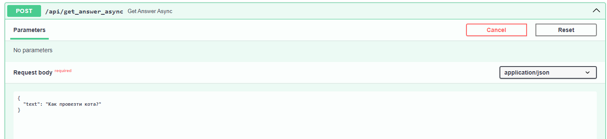

## Нейро консультант на основе ChatGPT и FastApi

Данный проект представляет собой нейро консультанта, созданного на базе ChatGPT и FastAPI. Основная задача заключается в автоматизации обработки и анализа клиентских писем, а также создании базы знаний для поддержки клиентов.

Проект включает следующие этапы:
1. Обработка писем из дампа JSON.
2. Очистка базы данных от личной информации.
3. Создание пар "вопрос/ответ".
4. Удаление дубликатов вопросов.
5. Прогон данных через ChatGPT для улучшения качества.
6. Определение категорий и подкатегорий вопросов.
7. Вывод структурированного документа в форматах MD и DOCX.
8. Загрузка итогового документа в Google Docs для последующей правки экспертами.
9. Подключение документа к консультанту через API.

## Структура папок

│
├── base/
│   ├── input/
│   │   └── `emails.json`
│   ├── output/
│   │   ├── `cleaned_emails.txt`
│   │   ├── `emails.txt`
│   │   ├── `qa_pairs.json`
│   │   ├── `unique_qa_pairs.json`
│   │   ├── `double_clean_unique_qa_pairs.json`
│   │   ├── `triple_clean_unique_qa_pairs.json`
│   │   ├── `faiss_db/`
│   │   ├── `base.txt`
│   │   ├── `base_final.md`
│   │   ├── `base_final.md_2.md`
│   │   └── `base_final.docx`
├── fastapi/
│   ├── `main.py`
│   ├── `chunks.py`
│   ├── `mdTOdocx.py`
│   ├── `.env`
│   └── `run_server.sh`
├── `makebase_main.ipynb`
├── `pst2json.py`
├── `mdTOdocx.py`
├── `email_parser.py`
├── `requirements.txt`
├── `.env`
└── `README.md`


### Установка 
Создаем окружение рядом с папками fastapi приложения

```
python -m venv venv
```

Активируем виртуальное окружение
```
venv/Scripts/activate
```

Устанавливаем зависимости

```
pip install -r requirements.txt
```


В файле .env необходимо указать ключ к Api OpenAi 
`OPENAI_API_KEY="sk-0Gw0...."`

### Первоначальная обработка писем из дампа json

- Поместите файл **`emails.json`** в папку base/input/.


├── base/
│   ├── input/
│   │   └── `emails.json`


Пример структуры `emails.json`:
```
[
    {
        "subject": "RE: Сообщение в центр поддержки",
        "sender_name": "name",
        "sent_on": "2000-10-11T10:49:00",
        "plain_text_body": "Здравствуйте, уважаемый пассажир!\r\n\r\nБлагодарим Вас за обращение в наш Центр... \r\nFrom: r\nСообщение: Вопрос клиента"
    },
    {
        "subject": "RE: Сообщение в центр поддержки ",
        "sender_name": "name",
        "sent_on": "2000-10-11T10:51:00",
        "plain_text_body": "Здравствуйте, уважаемый пассажир!\r\n\r\nБлагодарим Вас за обращение в наш Центр... \r\nFrom: r\nСообщение: Вопрос клиента"
    }
]
```   

- В файле **`makebase_main.ipynb`** расскомментируйте строки модуля парсинга переписки. В дальнейшем можно закомментировать этот модуль. Информация будет браться из файла emails.txt.

```
""" модуль парсинга почты из json"""
# расскоментить если начинаем парсить почту из json
import email_parser
# парсим input/emails.json и сохраняем в output/emails.txt
email_parser.main(filename, output_filename)
""" -------------------------------"""
```
 - Запустите все ячейки в `makebase_main.ipynb`.

В результате будут созданы файлы:

**`emails.txt`** - спарсенные данные переписки.

**`cleaned_emails.txt`** - данные переписки после удаления персональных данных (телефонов, email).

Пример данных в cleaned_emails.txt:

```
## Текст письма №10008:
Ответ службы поддержки:
Здравствуйте, уважаемый пассажир!
Дополнительное багажное место, платное место можете купить одним из следующих способов:
- заранее на официальной кассе авиакомпании (в рабочее время кассы);
- за 24 часа до вылета, во время онлайн регистрации на официальном сайте авиакомпании;
- на стойке регистрации в аэропорту, перед вылетом;

Старший оператор Центра Поддержки Клиентов
Вопрос клиента:
Напишите нам
Укажите ваш email:  <mailto:>
Ваше сообщение: Здравствуйте, я хотел доплатить за багаж на рейс ??? на ????? , что то не получается
Файл:
```

**`base_final.md_2.md`** - основной файл базы знаний в формате md используемый в консультанте. Вопрос дублируется в тексте
Пример данных в `base_final.md_2.md`:

```
# 1. Покупка и изменение билетов
## - Бронирование билета
### Вопрос: Где найти код бронирования на электронном билете?
Где найти код бронирования на электронном билете?
- Ответ: Код бронирования обычно указан на самом электронном билете, часто в верхней части документа. Обратите внимание на разделы с информацией о вашем рейсе или на отдельно выделенную строку с надписью "Booking Reference" или "PNR". 
### Вопрос: Как можно забронировать места рядом, если билеты приобретены на разных сервисах?
Как можно забронировать места рядом, если билеты приобретены на разных сервисах?
- Ответ: Услуга предварительного выбора мест доступна только для билетов, купленных на официальном сайте авиакомпании. Если билеты приобретены на сторонних сайтах или в агентстве, выбор мест будет доступен во время онлайн регистрации на рейс.
```


**`base_final.md`** - файл базы знаний в формате md оставлен для обратной совместимости конвертеров в DOCX, EXCEL и pandas df
Пример данных в `base_final.md`:

```
### Вопрос: Где найти код бронирования на электронном билете?
- Ответ: Код бронирования обычно указан на самом электронном билете, часто в верхней части документа. Обратите внимание на разделы с информацией о вашем рейсе или на отдельно выделенную строку с надписью "Booking Reference" или "PNR". 
### Вопрос: Как можно забронировать места рядом, если билеты приобретены на разных сервисах?
- Ответ: Услуга предварительного выбора мест доступна только для билетов, купленных на официальном сайте авиакомпании. Если билеты приобретены на сторонних сайтах или в агентстве, выбор мест будет доступен во время онлайн регистрации на рейс.
```
**`base_final.md.docx`** - итоговый файл базы знаний в формате docx

Если обьем писем достаточно большой, более 2000 писем, обработка через chatGPT займет 2-3 часа.

 - **`base_final.md.docx`** сохраняем на google doc. 
Загрузите `base_final.md.docx` на Google Docs. Сделайте документ доступным для редактирования и сохраните ссылку для дальнейшей работы через API.

## Запуск и настройка сервера для работы fastapi

├── fastapi/
│   ├── `main.py`
│   ├── `chunks.py`
│   ├── `mdTOdocx.py`
│   ├── `.env`
│   └── `run_server.sh`
├── base/
│   ├── output/
│   │   └── `base_final.md`

- Войдите на сервер с Linux (например, через PuTTY).

- Обновите систему:
```
sudo apt update
sudo apt upgrade
```

- Установите Python:
```
sudo apt install python3.10
```
- Установите необходимые библиотеки:
```
apt install python3-pip
pip install --upgrade pip
```

- Создайте рабочую директорию:
```
mkdir -p /home/
```
- Скопируйте в папку /home/ папки из проекта fastapi/* и base/output/base_final.md.

- Создайте виртуальное окружение:
```
apt install python3-venv
python3 -m venv venv
source venv/bin/activate
```
- Установите зависимости и библиотеки:
```
pip install --upgrade pip
pip install -r requirements.txt
```

- Установите screen для фонового запуска приложения:
```
sudo apt-get install screen
```
- Отредактируйте исполняемый файл run_server.sh и сохраните его в папке /usr/local/bin:

```
#!/bin/bash
source /home/venv/bin/activate
cd /home/fastapi/
screen -dmS api python3 /home/fastapi/main.py
screen -ls
```
- Сделайте файл исполняемым:
```
sudo chmod +x run_server.sh
```
- Запустите сервер:
```
run_server.sh
```
Проверьте запущенные процессы командой screen -ls.

Доступная документация к API предоставлена по адресу `you_server_ip:8000/docs`.

## Функции fastapi:

- **Загрузка базы из Google Docs**
Endpoint: **`/api/load_base_from_google_docx`**

Параметры:

text: URL к вашему `base_final.md.docx` документу базы знаний на Google Docs.

Пример запроса:
```
curl -X 'POST' \
  'http://you_server_ip:8000/api/load_base_from_google_docx' \
  -H 'accept: application/json' \
  -H 'Content-Type: application/json' \
  -d '{
  "text": "https://docs.google.com/document/d/1Mm6wBk....ydmRCAKMioOECeK/edit?usp=drive_link&ouid=10.....90369831&rtpof=true&sd=true"
}'
```

Пример ответа:
```
{
  "message": "base from text='https://docs.google.com/document/d/1Mm6wBk....ydmRCAKMioOECeK/edit?usp=drive_link&ouid=10.....90369831&rtpof=true&sd=true' save in md format and faiss db reload"
}
```


- **Перезагрузка базы faiss с сохраненной копии на диске**
Endpoint: **`/api/reload_faiss_db_from_disk`**
Параметры: отсутствуют.


- **Сохранение копии базы faiss на диск**
Endpoint: **`/api/save_faiss_db_to_disk`**
Параметры: отсутствуют.


- **Основная функция запросов к базе знаний**
Endpoint: **`/api/get_answer_async`**

Пример запроса:
```
curl -X 'POST' \
  'http://you_server_ip:8000/api/get_answer_async' \
  -H 'accept: application/json' \
  -H 'Content-Type: application/json' \
  -d '{
  "text": "Как провезти кота?"
}'
```

Request URL:
`http://you_server_ip:8000/api/get_answer_async`

Пример ответа:
```
{
  "message": "Здравствуйте, уважаемый пассажир! Для перевозки кота необходимо предоставить данные о виде животного, весе кота вместе с контейнером и габаритах контейнера в трех измерениях (высота, ширина, длина). Подробная информация об условиях перевозки животных доступна по ссылке: [Перевозка животных](https:...)."
}
```



